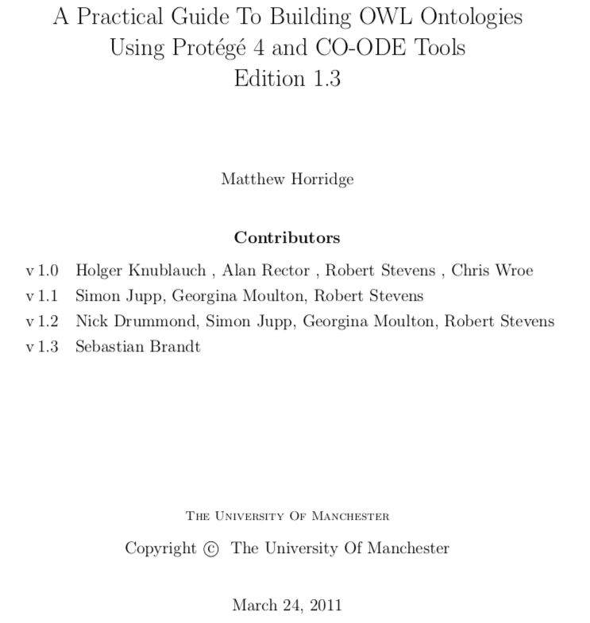

# pizza-ontology

A sample pizza ontology that describes various pizzas based on their toppings.

This example is based on this guide:

http://mowl-power.cs.man.ac.uk/protegeowltutorial/resources/ProtegeOWLTutorialP4_v1_3.pdf

